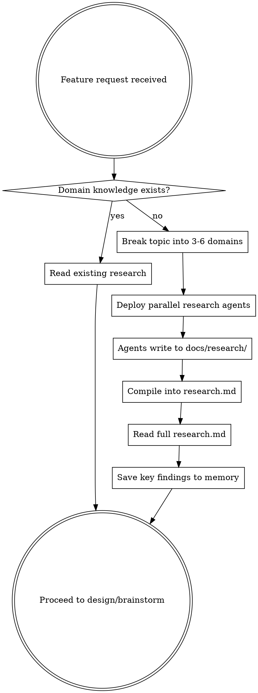

# Research Before Design

## Overview

Deploy parallel research agents before any design or implementation in an unfamiliar domain. Research produces docs/research/*.md files and a compiled research.md. You must read the research before writing specs.

## When to Use

- User asks for research explicitly
- About to design a feature in a domain you lack specific knowledge of
- A brainstorming or spec session would produce guesses instead of informed decisions
- The project has no existing research docs covering the topic

## When NOT to Use

- Bug fixes where the problem is understood
- Small code changes, refactors, config edits
- The project already has research docs covering the topic (read those instead)
- The user explicitly says to skip research

## The Rule

**Do not write a spec with guesses. Research first, design second.**

Jumping to design without domain knowledge produces specs full of "I assumed..." and "this is a guess." Those specs get rewritten once real knowledge arrives. Research costs time upfront but saves rework.

## Process

### 1. Scope the Research

Ask the user if unclear:
- What domain/topic?
- What is the end goal?
- Specific subtopics to focus on or skip?

### 2. Break into 3-6 Parallel Domains

Each domain becomes one research agent. Domains must be independent (no dependencies between agents) and together cover the topic completely.

### 3. Deploy Agents in Parallel

Launch all agents simultaneously with `run_in_background: true`. Each agent prompt must:
- State a role ("You are a quant researcher" / "You are a systems architect")
- List numbered subtopics with specific questions
- Request web searches for current real-world data
- Ask for exact rules, formulas, parameters, and real numbers
- Tell the agent to write findings to a specific file in docs/research/

### 4. Handle Stalled Agents

- If no output for 5+ minutes, note the agent as stalled
- Do not wait indefinitely -- after 10 minutes, move on
- Fill gaps from stalled agents using your own knowledge
- Tell the user which agents completed and which stalled

### 5. Compile into research.md

Create `research.md` in project root combining all findings:
- Table of contents with all parts
- One section per domain
- Gaps from stalled agents filled manually
- Source links preserved

### 6. Read Before Proceeding

Read the entire research.md before writing any spec or design doc. This is not optional. If you find yourself writing "I assumed" or "this threshold is a guess" in a spec, you did not research enough.

### 7. Save to Memory

Save key findings to memory files so future conversations have access without re-researching.

## Red Flags -- STOP

- "The user wants this quickly, I'll skip research" -- Speed does not justify guessing. Research agents run in parallel and take minutes.
- "I already know enough about this domain" -- If you cannot cite specific numbers, thresholds, or rules, you do not know enough.
- "I'll research after the design" -- Research after design means rewriting the design. Research first.
- "The codebase tells me everything I need" -- Codebases contain implementation, not domain knowledge.

## Output Checklist

- [ ] Individual docs in docs/research/ (one per agent)
- [ ] Compiled research.md in project root
- [ ] Full research.md read and internalized
- [ ] Key findings saved to memory
- [ ] User informed of summary and any gaps
